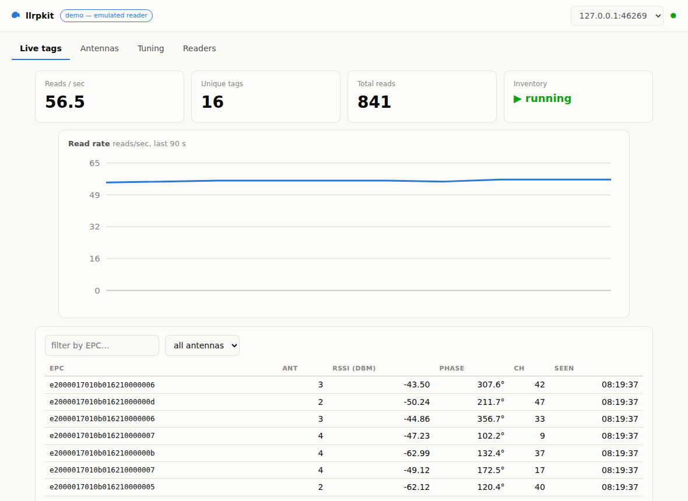

# llrpkit

**A modern, typed, asyncio-native Python toolkit for LLRP RAIN RFID readers — built Impinj-first (R700 and Speedway), with a reader emulator, a web dashboard, and a written field guide.**

> **On PyPI now — `pip install llrpkit`.** The whole stack is real: the full
> LLRP 1.0.1 wire protocol with Impinj Octane extensions (golden-vector tested),
> the asyncio `Reader` with streaming inventory, curated reader-mode guidance,
> antenna health monitoring with quiet-port alerts, a tuning-responsive emulator,
> host-side ignore policies, and the **web dashboard** — `llrpkit demo` gives you
> all of it against an emulated reader in one command, no hardware required.

## Why

The RAIN RFID open-source space is thin in a specific way. LLRP — the EPCglobal/GS1 Low Level
Reader Protocol — is stable and everywhere, yet a Python developer who wants to talk to an
Impinj reader today has essentially one option, and it is GPL-licensed, threading-based, and
designed around the previous reader generation. Impinj's official SDKs are .NET and Java only.
There is no permissively licensed, asyncio-native, typed Python library that treats the R700
and its Octane LLRP extensions as a first-class target — and nothing in the space that you can
try without physical hardware on your desk.

llrpkit exists to close all of that at once:

| Piece | What it is | Lands in |
|---|---|---|
| **Library** | Typed asyncio LLRP client: capability-aware config, inventory streams, Impinj Octane extensions (TagFocus, peak RSSI, phase, serialized TID) | Phases 1–3 |
| **Emulator** | A fake Impinj-style reader speaking real LLRP over TCP — the test rig, the CI backbone, and a zero-hardware demo | Phases 2–3 |
| **Dashboard** | FastAPI + WebSockets: multi-reader management, live tag streams, antenna health cards, an interactive reader-mode tuning workbench | Phase 4 |
| **Field guide** | Plain-English docs for the folklore: sessions and targets, reader modes, dense-reader environments, antenna health methodology | Phase 5 |

Beyond the core: **host-side ignore policies** (keep only the tags each antenna
should see, by item category — ignored tags never reach MQTT, a webhook, or your
ERP; editable live from the dashboard **Control tab**), **tag select filters**
(reader-side EPC prefix include/exclude),
**Gen2 tag memory access** (read/write/EPC-rewrite/kill with password support),
**GPIO** (outputs, GPI events), **GS1 EPC decoding** (SGTIN/SSCC/SGLN/GRAI/GIAI/GID-96
to GTINs and pure-identity URIs), **presence events** (arrive/depart with dwell —
the IoT interface's entry/exit, LLRP-side), an **MQTT bridge** (tags, presence
events, retained availability with a Last Will), **webhook delivery**
(batched HTTP POSTs straight to your ERP — pinned contract in
`docs/integration.md`), **capture** to CSV/JSONL,
**power/mode surveys**, and **settings profiles** shared between CLI and
dashboard. `docs/comparison.md` maps all of it against sllurp, the Octane SDK,
ItemTest, and the IoT Device Interface.

## Try it in sixty seconds (no reader required)

```console
$ pip install "llrpkit[dashboard]"
$ llrpkit demo
llrpkit demo — emulated reader + live dashboard → http://127.0.0.1:8000
```



Live tag stream, antenna health cards with quiet-port alerts, and a tuning
workbench where changing the RF mode or enabling TagFocus visibly changes what
you see — all against the built-in emulator. Prefer the terminal?

```console
$ llrpkit emulate --port 5084 &      # a fake Impinj-style reader
$ llrpkit inventory 127.0.0.1 --search-mode tagfocus --phase --count 5
connected: model 700, firmware 'llrpkit-emu 0.1', 4 antenna ports (Octane extensions on)
e2000017010b016210000002  ant 3   -52.06 dBm  phase  340.0°
...
$ llrpkit modes 127.0.0.1            # the RF mode table, with curated guidance
$ llrpkit capabilities 127.0.0.1     # power table, antenna ports, temperature
$ llrpkit inventory 127.0.0.1 --events --filter-epc e200 --output reads.csv
$ llrpkit read 127.0.0.1 --bank user --words 4      # Gen2 tag memory access
$ llrpkit sweep 127.0.0.1 --powers 15,20,25,30      # coverage survey
$ llrpkit decode 3074257bf7194e4000001a85           # EPC -> GTIN + serial
$ llrpkit gpio 127.0.0.1 --set 1=on                 # outputs, GPI events
```

Feeding an IoT stack instead? With the `mqtt` extra the same inventory
publishes straight to a broker — JSON tag messages plus a retained
online/offline status with an MQTT Last Will, while the reader stays in LLRP
mode with the full tuning control plane:

```console
$ pip install "llrpkit[mqtt]"
$ llrpkit inventory 127.0.0.1 --search-mode tagfocus --mqtt-broker 127.0.0.1
$ mosquitto_sub -t 'llrpkit/#' -v      # in another terminal
llrpkit/127.0.0.1/status {"status": "online", ...}
llrpkit/127.0.0.1/tags {"reader": "127.0.0.1:5084", "epc": "e28011...", "antenna": 3, "rssi_dbm": -52.25, ...}
```

## The API

```python
import asyncio

from llrpkit import Reader


async def main() -> None:
    async with Reader("192.168.1.10") as reader:
        print(reader.model_number, reader.firmware)
        async for tag in reader.inventory(antennas=(1, 2), session=1, search_mode=3):
            print(tag.epc_hex, tag.antenna, tag.rssi_dbm)


asyncio.run(main())
```

Works identically against the emulator (`Reader("127.0.0.1", emu.port)`), a Speedway,
or an R700 in LLRP mode. The full dashboard demo (`llrpkit demo`) arrives with Phase 4.

## Roadmap

All five build phases are shipped — wire protocol & codegen, client & inventory,
tuning & antenna health, dashboard, and docs/hardening — and the current release
(`v0.2.0`) adds host-side ignore policies and full dashboard control. Full history
in [`CHANGELOG.md`](CHANGELOG.md).

## Development

```console
$ git clone https://github.com/kyronfeast/llrpkit && cd llrpkit
$ pip install -e ".[dev,docs]"
$ pre-commit install
$ pytest          # tests + coverage
$ ruff check . && ruff format --check . && mypy
$ mkdocs serve    # docs at http://127.0.0.1:8000
```

You do not need an RFID reader to contribute — the emulator is the development target.
See [`CONTRIBUTING.md`](CONTRIBUTING.md).

## License

[MIT](LICENSE).

## Trademarks

Impinj, Speedway, R700, Octane, and related marks are trademarks of Impinj, Inc.
This project is an independent open-source effort and is not affiliated with,
sponsored, or endorsed by Impinj.
